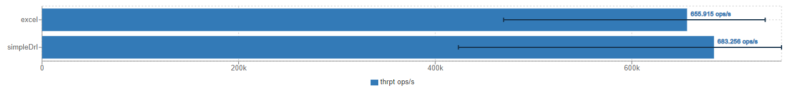

# Performance Test of Drools with JMH

This is a small test to evaluate the performance of Drools. It is meant together with a performance test of Camunda DMN - [JMH-DMN](https://github.com/DennisRippinger/jmh-dmn). 

The test uses a rule set which does simple logic operations on the input. IT does this with a usual `drl` file and an `excel` file.

To run execute:

```bash
$ mvn clean package && java -jar target/benchmarks.jar -rf json
```

The resulting file can be visualised with [JMH Visualizer](http://jmh.morethan.io)


